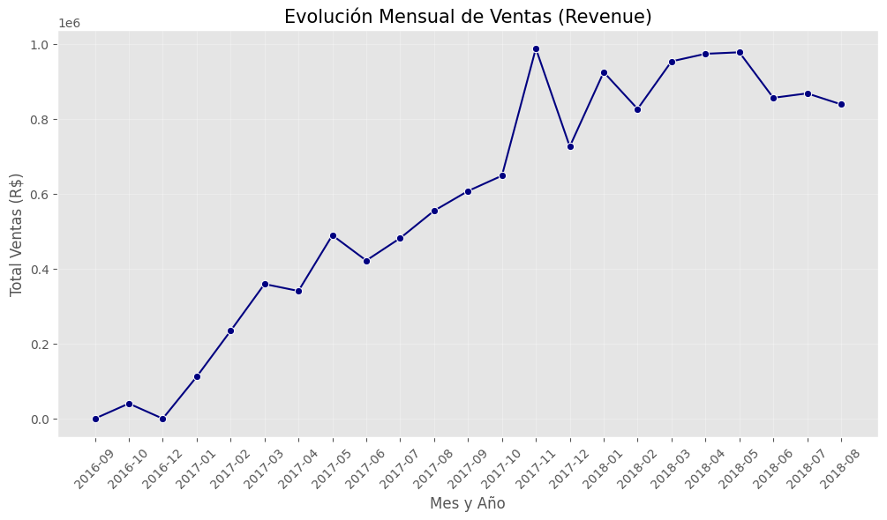
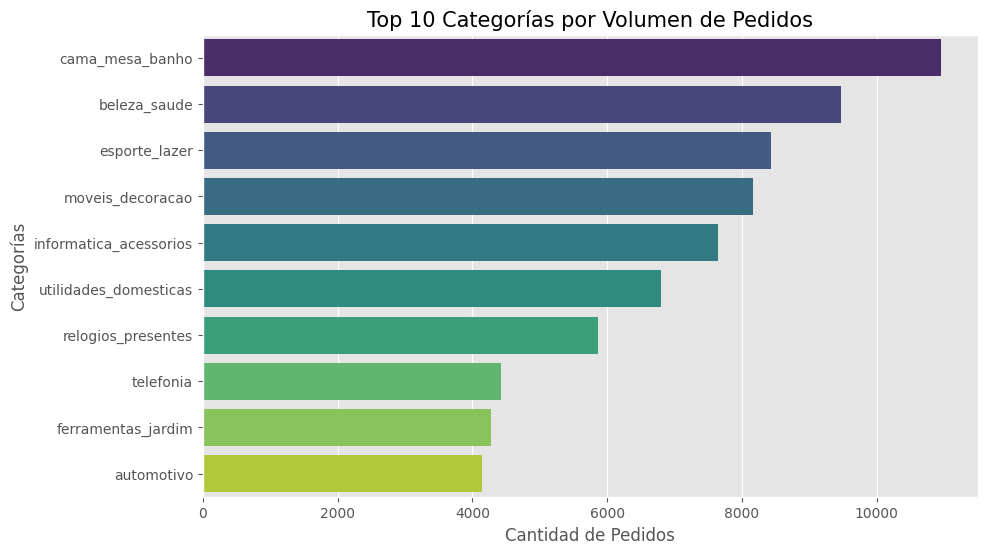
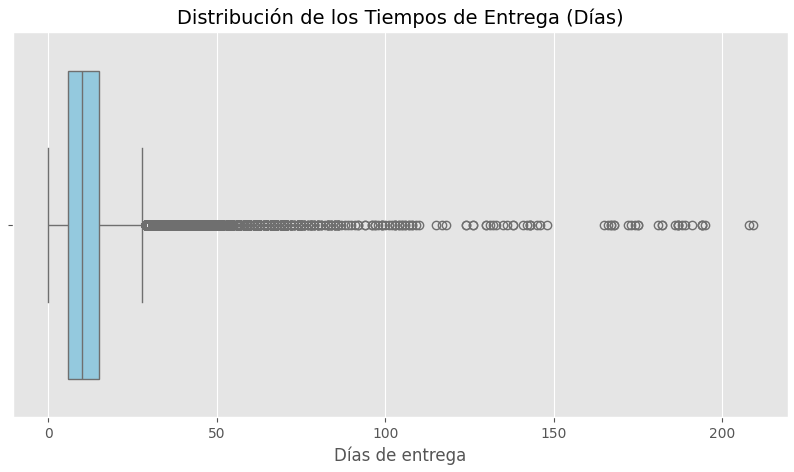

# Análisis de Performance Comercial y Logística - E-Commerce (Olist Brasil) 📦

## 📌 Resumen del Proyecto

Este proyecto forma parte de mi portafolio de análisis de datos, enfocado en el uso de **Python** para resolver problemas de negocio reales. El objetivo es analizar el conjunto de datos de Olist (el mayor marketplace de Brasil) para entender el ciclo comercial, el desempeño logístico y cómo la eficiencia en las entregas impacta directamente en la satisfacción del cliente (Review Score).

## 🛠️ Herramientas Utilizadas

* **Jupyter Lab:** Entorno de desarrollo para el análisis interactivo.
  
* **Python (Pandas & Numpy):** Limpieza, manipulación de datos relacionales y creación de métricas de negocio.
  
* **Matplotlib & Seaborn:** Creación de visualizaciones estadísticas y tendencias.

## 🧹 Procesamiento y Limpieza de Datos

Para garantizar la integridad de los insights, realicé las siguientes transformaciones en el dataset:

* **Estandarización de Fechas:** Conversión de múltiples columnas (compra, aprobación, entrega) al formato `datetime` para cálculos temporales precisos.
  
* **Manejo de Nombres de Categoría:** Tratamiento de valores nulos en categorías de productos, asignándoles la etiqueta `not_defined` para no perder registros de ventas.
  
* **Manejo de Métricas (KPIs):** Creación de la métrica `delivery_time_days` (tiempo real de entrega) y `delivery_delta_days` (diferencia contra la promesa de entrega).

## 📊 Visualización y Hallazgos Clave

### 1. Evolución Mensual de Ventas (Revenue)

* **Insight:** El volumen de ingresos muestra una tendencia de crecimiento constante mes a mes, con una pequeña caída en el final del periodo analizado.

### 2. Top 10 Categorías por Volumen de Pedidos

* **Insight:** Las categorías de **Beleza & Saúde** y **Cama, Mesa & Banho** son los más pedidos del marketplace.

### 3. Distribución de Tiempos de Entrega y Outliers

* **Insight:** El análisis de distribución reveló la presencia de **outliers críticos** con tiempos de entrega que superan los meses, lo que representa un riesgo para la fidelización de clientes.

## 💡 Análisis de Correlación y Conclusiones

Realicé un análisis de correlación para medir el impacto en la experiencia del usuario:
* **Resultado:** Se identificó una correlación negativa de -0.30 entre el tiempo de entrega y el puntaje de satisfacción (`review_score`).
* **Conclusión:** A medida que aumentan los días de entrega, la calificación del cliente disminuye.
* **Recomendación:** Para el sector de Banca Empresa, es importante mejorar la entrega final de los servicios y reducir los casos fuera de lo común en la logística, ya que esto ayuda a aumentar la satisfacción de los clientes.

---

*Proyecto creado por Gianello Marcos como parte del portafolio de Análisis de Datos.*
