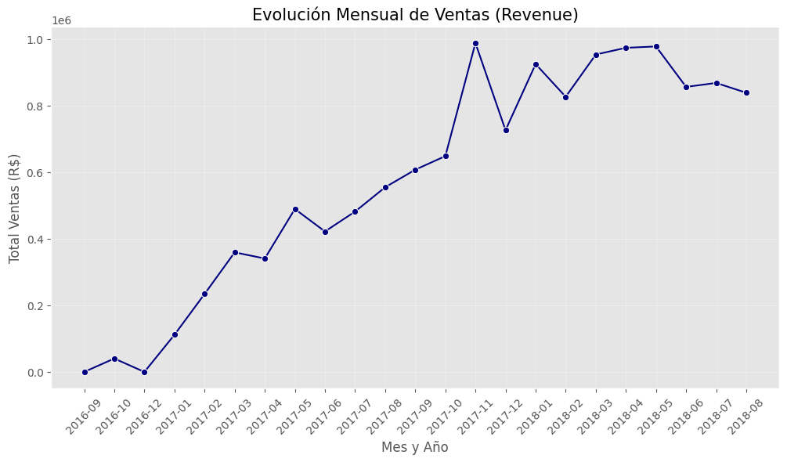
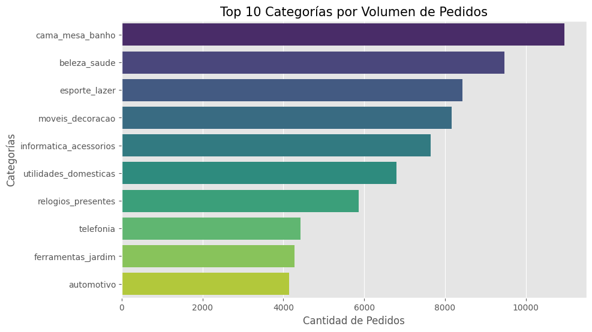
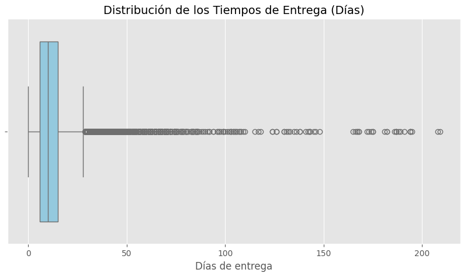

# Análisis de Performance Comercial y Logística - E-Commerce (Olist Brasil)

Análisis de datos de un marketplace brasileño para evaluar el desempeño comercial, la logística de entregas y su relación con la satisfacción del cliente.
Herramientas: Python - Pandas - NumPy - Matplotlib - Seaborn - Jupyter Lab

---

## Objetivo

Analizar el comportamiento comercial y logístico de Olist para identificar patrones en las ventas, categorías de productos y tiempos de entrega, evaluando cómo el desempeño logístico se relaciona con la satisfacción del cliente.

---

## Proceso

Dataset Olist → Python → Limpieza y transformación → Análisis → Visualización → Insights

- Integración y manipulación de datos.
- Conversión y estandarización de fechas.
- Tratamiento de valores nulos.
- Creación de métricas de negocio.
- Análisis de ventas y categorías.
- Análisis del desempeño logístico.
- Análisis de correlación entre entregas y satisfacción.
- Visualización de resultados.

---

## Análisis y Visualizaciones

### 1. Evolución Mensual de Ventas

Se analizó la evolución mensual de los ingresos para identificar tendencias y variaciones durante el periodo estudiado.

Insight: Los ingresos presentan una tendencia general de crecimiento durante gran parte del periodo analizado, con una disminución hacia el final.

---

### 2. Top 10 Categorías por Volumen de Pedidos

Se analizaron las categorías con mayor volumen de pedidos para identificar los principales productos demandados.

Insight: **Beleza & Saúde** y **Cama, Mesa & Banho** se encuentran entre las categorías con mayor cantidad de pedidos.

---

### 3. Distribución de Tiempos de Entrega

Se analizó la distribución de los tiempos reales de entrega para identificar comportamientos atípicos.

Insight: Se identificaron casos extremos con tiempos de entrega considerablemente superiores al comportamiento habitual, representando posibles problemas operativos.

---

## Principales hallazgos

Ventas:
Se observó una tendencia general de crecimiento en los ingresos durante gran parte del periodo analizado.

Categorías:
Las categorías **Beleza & Saúde** y **Cama, Mesa & Banho** destacan por su volumen de pedidos.

Logística:
Se identificaron outliers con tiempos de entrega considerablemente elevados, que pueden representar oportunidades de mejora en la operación logística.

Satisfacción del cliente:
Se encontró una correlación negativa de aproximadamente **-0.30** entre el tiempo de entrega y el `review_score`. Esto indica que los mayores tiempos de entrega tienden a asociarse con menores niveles de satisfacción.

---
